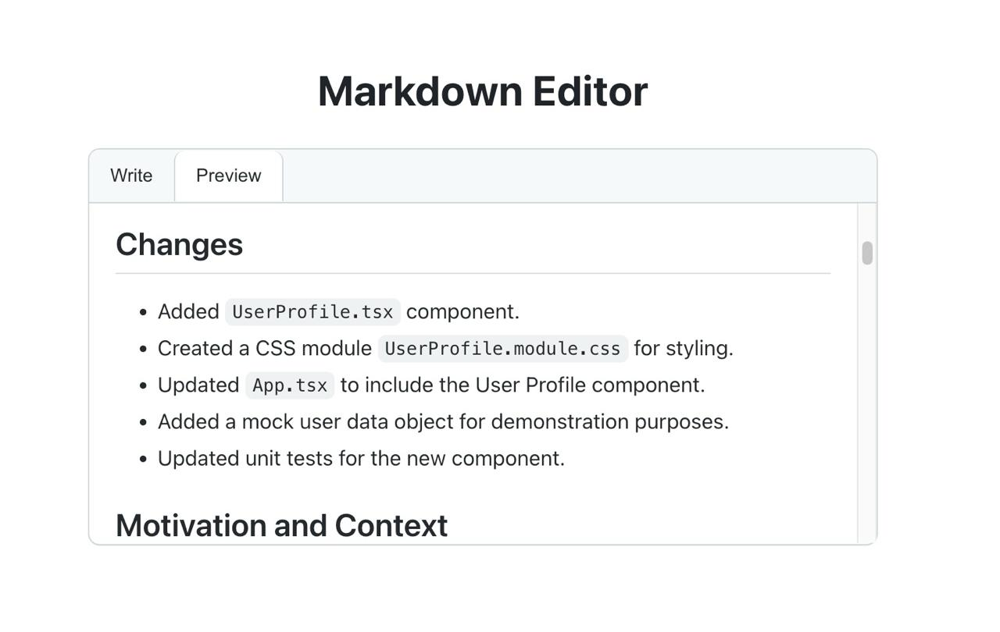
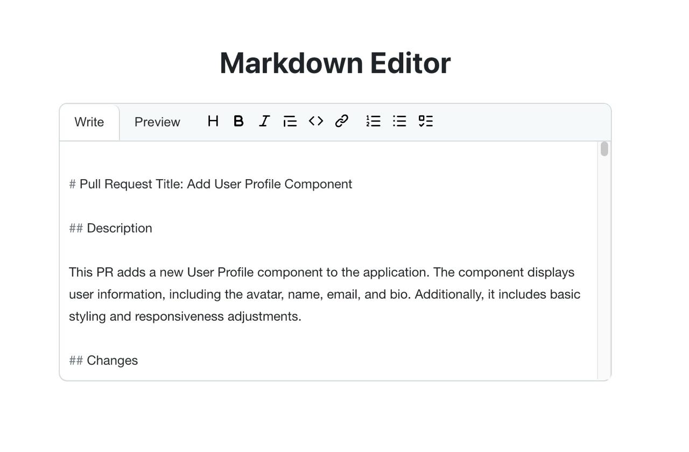

# Tutorials - A markdown editor using @uiw/react-md-editor

This tutorial covers how to create a markdown editor using the [@uiw/react-md-editor library](https://www.npmjs.com/package/@uiw/react-md-editor) and how to integrate into your web application. To illustrate the usage of the library, we will reproduce the Github markdown editor when you open a pull request.

## Table of contents

- [Tutorials - A markdown editor using @uiw/react-md-editor](#tutorials---a-markdown-editor-using-uiwreact-md-editor)
  - [Table of contents](#table-of-contents)
  - [Overview](#overview)
    - [Features](#features)
    - [Screenshot](#screenshot)
    - [Links](#links)
  - [My process](#my-process)
    - [Built with](#built-with)
  - [Author](#author)

## Overview

### Features

- Create a custom toolbar
- Overwrite the default css.

### Screenshot

### Links

- Live Site URL: [vercel](https://markdowneditor-j8n4lo316-mathieus-projects-05c34cfb.vercel.app/)

## My process

### Built with

- @uiw/react-md-editor library
- Vite
- React
- Typescript

## Author

- Website - [mathieuthiry.fr](https://mathieuthiry.fr/)
