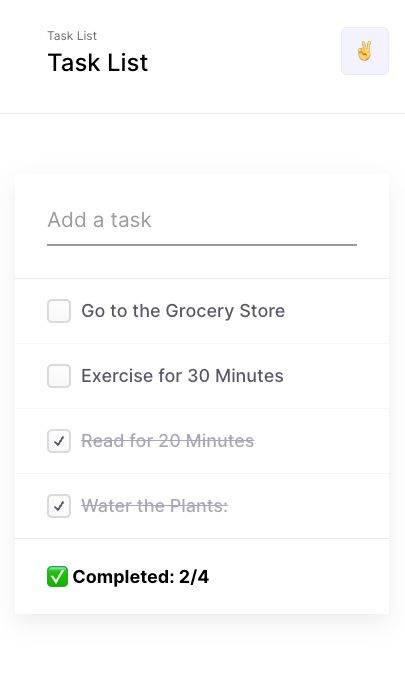

# Tutorials - A todo app using Redux Toolkit

This tutorial covers building a simple Todo application using Redux Toolkit for state management. The focus is on demonstrating how Redux Toolkit simplifies the process of working with Redux in a React application inspired from this great [design](<https://www.figma.com/file/T5sN874A6Ogst6mjl1yRLW/Todo-List-for-Figma-projects-(Community)?node-id=1%3A285&mode=dev>) spotted on figma.

## Table of contents

- [Tutorials - A todo app using Redux Toolkit](#tutorials---a-todo-app-using-redux-toolkit)
  - [Table of contents](#table-of-contents)
  - [Overview](#overview)
    - [Features](#features)
    - [Screenshot](#screenshot)
    - [Links](#links)
  - [My process](#my-process)
    - [Built with](#built-with)
  - [Author](#author)

## Overview

### Features

- Add, delete, and mark todos as complete.
- State persistence using Redux Toolkit.

### Screenshot

### Links

- Live Site URL: [netlify](https://redux-toolkit-topaz.vercel.app/)

## My process

### Built with

- Vite
- React
- Redux Toolkit
- Typescript

## Author

- Website - [mathieuthiry.fr](https://mathieuthiry.fr/)
